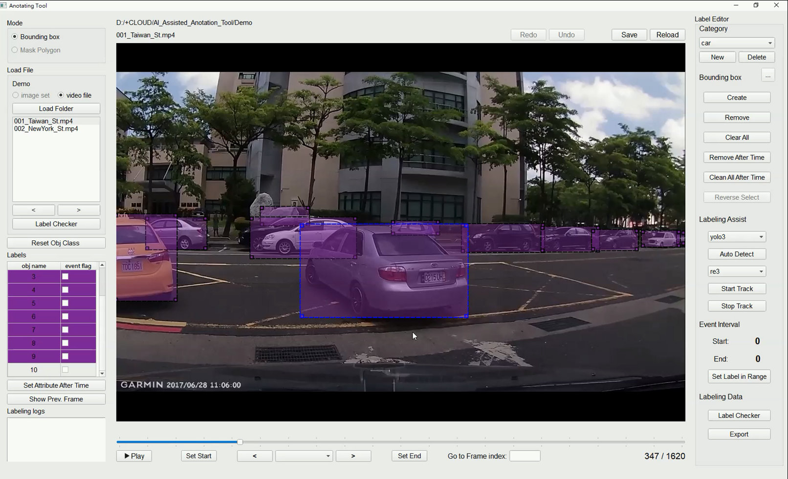

# AI Assisted Annotation Tool for Multi-task Video Labeling





It is written in **Python** and uses **Qt** for its graphical interface.

This tool is designed for **general-purpose video annotation**, which is mainly used to record mutual information included in one video such as **objects,** **object tracking**, **object status**, the **time interval of event** occurrence to construct the multi-task dataset. 

The annotation tool utilizing some existing pre-trained models or trained models to **assisted annotation tasks**. Through this tool, we could know the existing **model's prediction defects** or we could record multiple types of attributes in the collecting videos to build our custom dataset.

----


## Requirements

Python 3.5,  TensorFlow 1.12, Keras 2.2.4 and other packages listed in `requirements.txt`.


## Installation

1. Clone this repository

2. Install dependencies

   ```bash
   pip install -r requirements.txt
   ```

3. Download each models' pre-trained weights :

   * For **Object Detection** model:
    > (1) **Mask-RCNN**
     >
     > Download pre-trained COCO weights from the [releases page](https://github.com/matterport/Mask_RCNN/releases).  (mask_rcnn_coco.h5)
   
     > (2)  **Faster-RCNN**
     >
     > Download pre-trained weights from the [Model Zoo](https://github.com/tensorflow/models/blob/master/research/object_detection/g3doc/tf1_detection_zoo.md).  
   
     > (3)  **Yolo**
     >
     > Download YOLOv3 weights from [YOLO website](http://pjreddie.com/darknet/yolo/).
     >
     > ```bash
     > wget https://pjreddie.com/media/files/yolov3.weights
     > ```
     > Convert .weights file into .h5 file
     >
     > ```bash
     > python convert.py yolov3.cfg yolov3.weights model_data/yolo.h5
     > ```
   
   

    * For **Object Tracking** model:

     **Re3**

     Download [link]( https://goo.gl/bg2Gs4) for the Caffe model weights
     > Convert caffe file into tensorflow weights
     > ```bash
     > python caffe_to_tf.py
     > ```


## Settings for Detection & Rendering

Please checkout **ObjClasses** folder, you would see three files:

```
Obj_Classes_Name.txt  // Each line represent categories of object in your annotation file
Obj_Classes_Color.txt // Rendering RGB color for each class
Frame_Classes.txt     // Each line represent categories of frame level classification 
```


## Usage

1. Run the following command:

```bash
python main.py 
```

2.  For more annotation tutorials please forward here.

3. The annotations are saved as a JSON file.

   


## Export JSON File Example:
For each video, the annotation tool create a JSON file formatted as following.
```
{
    "File name": "xxxxxxxxxx.mp4",
    "Resolution": [ 1280,720], "FPS": 30, "Total frame": 1620,
    "Event type": "",
    "Event interval": [],
    "Frame event": {},
    "Object bounding box": {
        "347": {
            "10": {
                "class": "car",
                "bbx": [ 414, 343, 791, 554],
                "event state": false
            },
            "9": {
                "class": "car",
                "bbx": [ 0, 320, 137, 517 ],
                "event state": false
            }
        },
        "348": {
            "10": {
                "class": "car",
                "bbx": [ 414, 343, 791, 554],
                "event state": false
            },
            "9": {
                "class": "car",
                "bbx": [
                    0, 321, 136, 516
                ],
                "event state": false
            }
        }    
    }
}
```
where 
The **"Object bounding box"** record containing each **instance's name**, **object class**, **event state** and **bounding box location** in each frame index. 
The **"Event type"** is used for **video classification**,
The "**Event interval**" and **"Frame event"** are used for **event detection** and **frame level classification**.


## Attached Your own Detection Model

If you want to attach your own detection model to this tool, please import and create a custom Class with **detect_bbx()** member function in it, which takes one input frame with RGB order and return single list that contains list of instances. 

Each instance is formatted with [class name, score,  bounding box], where bounding box information is an ordered list combined with the bounding box's center position of x, center position of y, bounding box's width, bounding box's height.

Example of return format for each instance:

```
[class , score, [cx,cy,w,h]]
```

Notice that if the detection model has **mismatch name for the same class** in the annotator (eg. motorbike v.s. motorcycle ), please also translate it at **detect_bbx()**  method. 

## Citations

* **ICON create Tool**
  
  ```
  UI/logo.png
  ```
  Apps Logo Frree Created with [DesignEvo]( https://www.designevo.com/tw/)
* **Re3 tracker**
```latex
@article{gordon2017re3,
  title={Re3: Real-Time Recurrent Regression Networks for Object Tracking},
  author={Gordon, Daniel and Farhadi, Ali and Fox, Dieter},
  journal={arXiv preprint arXiv:1705.06368},
  year={2017}
}
```
* **Mask R-CNN**

```latex
@misc{matterport_maskrcnn_2017,
  title={Mask R-CNN for object detection and instance segmentation on Keras and TensorFlow},
  author={Waleed Abdulla},
  year={2017},
  publisher={Github},
  journal={CVPR},
  howpublished={\url{https://github.com/matterport/Mask_RCNN}},
}
```
* **Faster R-CNN**, using TensorFlow Object Detection API
```latex
Speed/accuracy trade-offs for modern convolutional object detectors.
Huang J, Rathod V, Sun C, Zhu M, Korattikara A, Fathi A, Fischer I, Wojna Z,
Song Y, Guadarrama S, Murphy K, CVPR 2017
```

* **Yolo3**
```latex
@misc{qqwweee_2018,
  author = {qqwweee},
  title = {keras-yolo3},
  year = {2018},
  publisher = {GitHub},
  journal = {GitHub repository},
  howpublished = {\url{https://github.com/qqwweee/keras-yolo3}}
}
```

